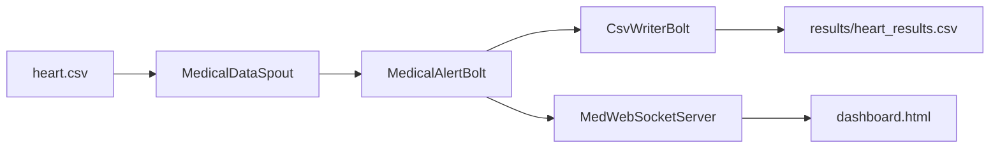
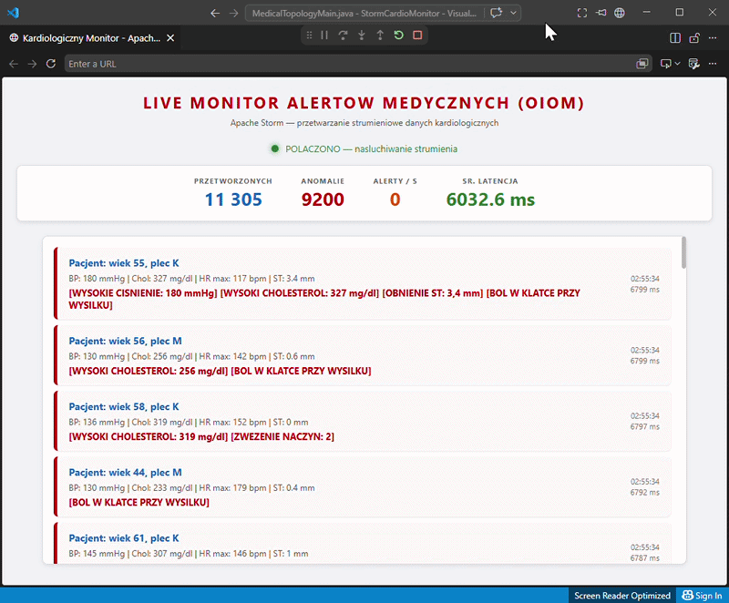

# StormCardioMonitor

StormCardioMonitor to przykładowa aplikacja strumieniowa przygotowana z wykorzystaniem **Apache Storm**.  
Projekt symuluje prosty system monitorowania parametrów kardiologicznych pacjentów. Dane wejściowe są odczytywane z pliku CSV, następnie przetwarzane w topologii Storm, analizowane pod kątem przekroczenia ustalonych progów alarmowych, zapisywane do pliku wynikowego oraz wyświetlane w czasie rzeczywistym w dashboardzie webowym.

Projekt został przygotowany w ramach przedmiotu **Obliczenia rozproszone w klastrach i gridach**.

## Cel projektu

Celem projektu jest pokazanie praktycznego zastosowania Apache Storm do przetwarzania danych strumieniowych w czasie zbliżonym do rzeczywistego.

Aplikacja nie jest systemem diagnostycznym i nie służy do podejmowania decyzji medycznych.  
Wykrywane „anomalie” oznaczają jedynie przekroczenie prostych, przyjętych w kodzie progów alarmowych.

## Technologie

- Java 11
- Apache Storm 2.6.0
- Maven
- Java-WebSocket 1.5.3
- HTML / JavaScript
- CSV

## Architektura aplikacji

Aplikacja składa się z trzech głównych komponentów Apache Storm:

```text
MedicalDataSpout -> MedicalAlertBolt -> CsvWriterBolt
```

Dodatkowo wykorzystano serwer WebSocket oraz prosty dashboard HTML do prezentacji alertów w przeglądarce.



## Struktura projektu

```text
StormCardioMonitor/
├── pom.xml
├── dashboard.html
└── src/main/
    ├── java/com/example/
    │   ├── MedicalTopologyMain.java
    │   ├── MedicalDataSpout.java
    │   ├── MedicalAlertBolt.java
    │   ├── CsvWriterBolt.java
    │   └── MedWebSocketServer.java
    └── resources/
        └── heart.csv
```

## Opis komponentów

| Komponent | Opis |
|---|---|
| `MedicalDataSpout` | Odczytuje rekordy z pliku `heart.csv` i emituje je jako krotki do topologii Storm. |
| `MedicalAlertBolt` | Analizuje rekordy, sprawdza progi alarmowe, generuje alerty i mierzy opóźnienie przetwarzania. |
| `CsvWriterBolt` | Zapisuje przetworzone dane do pliku `results/heart_results.csv`. |
| `MedWebSocketServer` | Przesyła wykryte alerty do dashboardu przez WebSocket. |
| `dashboard.html` | Wyświetla alerty i statystyki działania aplikacji w przeglądarce. |

## Reguły wykrywania anomalii

Aplikacja oznacza rekord jako anomalię, jeżeli spełniony zostanie co najmniej jeden z poniższych warunków:

| Parametr | Warunek | Znaczenie |
|---|---:|---|
| Ciśnienie spoczynkowe | `trestbps >= 140` | wysokie ciśnienie |
| Cholesterol | `chol >= 240` | wysoki cholesterol |
| Maksymalne tętno | `thalach <= 100` | niskie maksymalne tętno |
| Obniżenie odcinka ST | `oldpeak >= 2.0` | podwyższone obniżenie ST |
| Ból w klatce przy wysiłku | `exang == 1` | wystąpienie bólu przy wysiłku |
| Liczba zwężonych naczyń | `ca >= 2` | zwiększona liczba zwężonych naczyń |

Przykładowy komunikat alarmowy:

```text
[WYSOKIE CISNIENIE: 145 mmHg] [WYSOKI CHOLESTEROL: 250 mg/dl]
```

## Uruchomienie aplikacji

Po uruchomieniu aplikacji:

- startuje lokalna topologia Apache Storm,
- uruchamiany jest serwer WebSocket na porcie `8887`,
- dane z pliku `heart.csv` są odczytywane rekord po rekordzie,
- rekordy są analizowane przez `MedicalAlertBolt`,
- wyniki są zapisywane do pliku CSV,
- alerty są wypisywane w konsoli,
- dashboard może wyświetlać alerty w czasie rzeczywistym.

Domyślny czas działania aplikacji wynosi 60 sekund.

## Dashboard

Aby zobaczyć alerty w czasie rzeczywistym, należy uruchomić aplikację, a następnie otworzyć plik:

```text
dashboard.html
```

W dashboardzie widoczne są między innymi:

- status połączenia,
- liczba przetworzonych rekordów,
- liczba wykrytych anomalii,
- liczba alertów na sekundę,
- średnia latencja,
- lista najnowszych alertów.

## Demo

Poniższy GIF przedstawia działanie dashboardu w czasie rzeczywistym. Po uruchomieniu topologii Apache Storm alerty wykrywane przez aplikację są przesyłane przez WebSocket i wyświetlane w przeglądarce.



## Wyniki działania

Wyniki przetwarzania są zapisywane w pliku:

```text
results/heart_results.csv
```

Plik wynikowy zawiera między innymi:

- dane pacjenta,
- informację, czy wykryto anomalię,
- komunikat alertu,
- opóźnienie przetwarzania,
- liczbę przetworzonych krotek,
- liczbę wykrytych anomalii.

Przykładowe kolumny:

```text
timestamp,age,sex,cp,trestbps,chol,thalach,exang,oldpeak,ca,target,anomaly,alertMessage,latencyMs,tupleCount,anomalyCount
```

## Konfiguracja eksperymentów

Liczbę równoległych instancji komponentów można zmienić w klasie `MedicalTopologyMain.java`.

Przykład:

```java
builder.setSpout("medical-spout", new MedicalDataSpout(), 4);

builder.setBolt("alert-bolt", new MedicalAlertBolt(), 4)
       .shuffleGrouping("medical-spout");
```

Zwiększenie liczby instancji pozwala sprawdzić wpływ równoległości na przepustowość i opóźnienie przetwarzania.

Progi alarmowe można zmienić w klasie `MedicalAlertBolt.java`:

```java
private static final int HIGH_BP = 140;
private static final int HIGH_CHOL = 240;
private static final int LOW_MAX_HR = 100;
private static final double HIGH_ST_DEPR = 2.0;
```


## Uwagi

- Dane wejściowe pochodzą z pliku CSV i służą do symulacji strumienia danych.
- Aplikacja działa lokalnie i nie wymaga pełnego klastra Storm.
- Projekt ma charakter edukacyjny i demonstracyjny.
- Wykrywanie anomalii jest oparte na prostych regułach progowych.
- Wyniki nie powinny być traktowane jako diagnoza medyczna.
